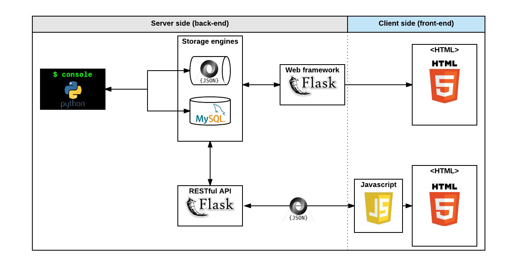

# The AirBnB clone project (ongoing)

**Tech Stack: Python, HTML5, CSS3**

***

**Data diagram**

***

**Files and Directories**

* `models` directory will contain all classes used for the entire project. A class, called “model” in a OOP project is the representation of an object/instance.
* `tests` directory will contain all unit tests.
* `console.py` file is the entry point of our command interpreter.
* `models/base_model.py` file is the base class of all our models. It contains common elements:

++ attributes: `id, created_at and updated_at`
++ methods: `save()` and `to_json()`

* `models/engine` directory will contain all storage classes (using the same prototype).
